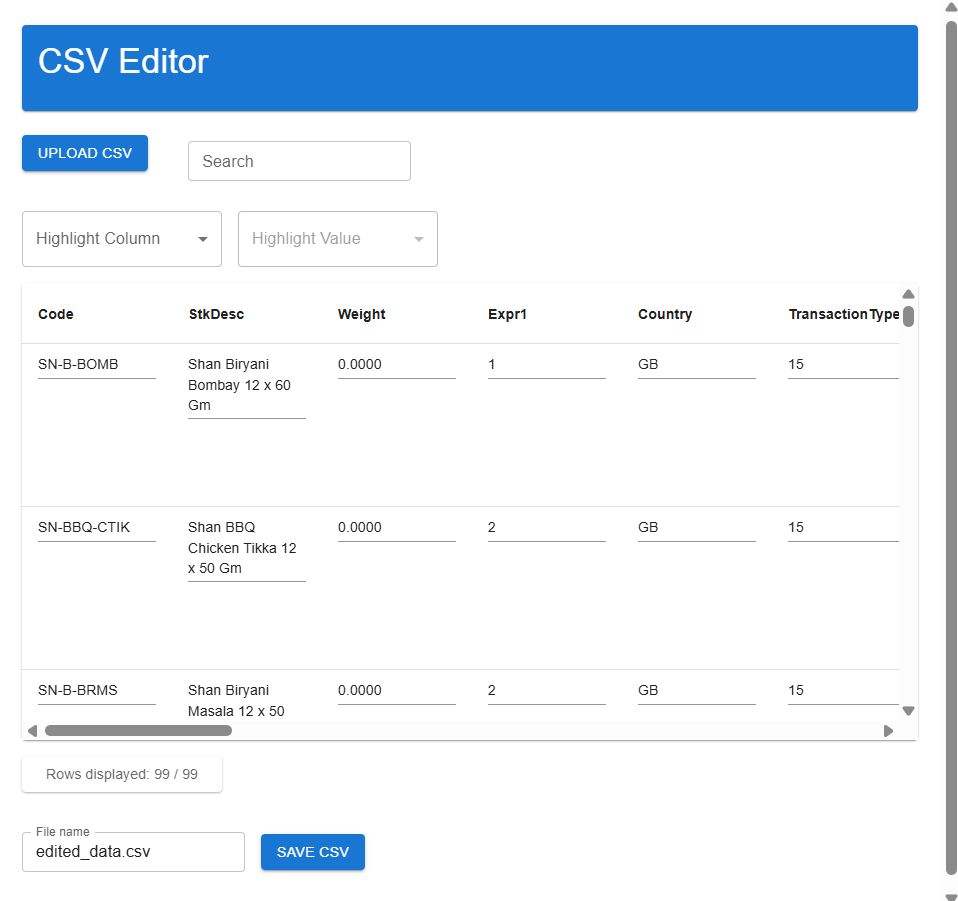

# CSV Editor Web Application
Task:
A single-page React application that allows users to load, view, edit, search, and simulate saving a dataset from a CSV file. This project is built using **Vite**,**React**, **Material UI** and **TypeScript**  with data processed entirely in-memory—no backend required.

---------------------------------------------------------------------

Final Tech Stack:
Bundler:    	Vite	
Framework:  	React	
UI FrameworK:   Material UI (MUI)
Language:       TypeScript
CSV Parsing:    PapaParse       

---------------------------------------------------------------------

## Features
- Load and parse CSV files on the client side
- Display data in a responsive, editable Material UI table
- Filter/search rows by keyword
- Inline editing of cell data
- Save data and export .csv
- Row counter
- Column sorting
- Optional: Row highlighting or grouping based on column values

## Setup Instructions
### 1. Clone the Repository
Git clone "https://github.com/mushfiqur0002/csv-editor-app.git"

### 2. Install Dependencies
-Make sure you have Node.js (v16 or later) and npm installed.
-Open Visual Studio Code inside folder "csv-editor-app"
-Open Terminal and type: npm install

### 3. Run the App Locally
on the VS Code terminal type: npm run dev
A Link will appear on console, "http://localhost:...."
Open browser and vist: "http://localhost:...."

## Web App Demo
Click the button " UPLOAD CSV", select you .csv file. The app will load the file 
and display an interactable table. (Wait until it is loaded)

You can now interact with table's content direct and make chanages, **Search by Keyword**, highlite specific **Column and Value**. 
Below the table, there is a **rows displayed counter** and lastly you can **Save Edited Data as .CSV**.

